# Fact Knowledge Layer

A **document intelligence knowledge layer for financial and enterprise PDFs**: ingest PDFs, extract evidence-grounded,
normalised facts, and discover cross-document relationships (`CORROBORATES`,
`LIKELY_CONTRADICTION`, `APPARENT_CONTRADICTION_RESOLVED`, `UNCERTAIN`).

Built for the **Superjoin VIT 2026 Engineering Intern** assignment. Stack: React + FastAPI + PostgreSQL (pgvector),
LLM provider-agnostic (default Google Gemini, free tier; offline `sample` mode needs no API key). Runs locally — no
deployment is included.

## Setup and Run Instructions

Prerequisites: Docker (Postgres+pgvector), Python 3.10+, Node 18+.

```bash
# 1) Postgres + pgvector
docker compose up -d db

# 2) Backend
cd backend
python -m venv .venv && .venv/bin/pip install -r requirements.txt
cp ../.env.example .env        # fill GEMINI_API_KEY only for live mode; sample works without it
POSTGRES_HOST=localhost .venv/bin/uvicorn app.main:app --reload --port 8000
# API docs → http://localhost:8000/docs

# 3) Frontend
cd ../frontend
npm install && npm run dev     # http://localhost:5173

# 4) Tests (needs the running DB)
cd ../backend
POSTGRES_HOST=localhost .venv/bin/python -m pytest    # 94 passed
```

Environment: `LLM_PROVIDER` / `EMBEDDING_PROVIDER` (`gemini | ollama | sample`), model names, and Postgres
credentials — all in `.env` (never committed; only `.env.example` with placeholders is checked in).

## Quick Evaluation

```bash
docker compose up -d db
cd backend  && POSTGRES_HOST=localhost .venv/bin/uvicorn app.main:app --reload --port 8000
cd ../frontend && npm install && npm run dev
```

1. Open http://localhost:5173 → **Documents** → upload any PDF (or `POST /api/documents/upload` with a
   `files` field).
2. Open the document → **Re-run full pipeline** → watch the status advance `PARSING → … → REASONED`
   (or `POST /api/documents/{id}/pipeline`, then poll `GET /api/documents/{id}`).
3. Inspect the results the assignment asks for:
   - **Facts** — extracted, normalised rows (`/api/facts`)
   - **Source evidence** — page/block traces each fact points back to (`/api/documents/{id}/evidence`,
     `/api/documents/{id}/logs`)
   - **Cross-document relationships** — verdicts with reasons (`/api/relationships`)
   - **Evaluation** — the four required cases (`/api/evaluation/results`); re-run offline with
     `python -m scripts.register_cases` + `python -m scripts.evaluate` (sample mode).

## Video Demo

Demo video (≤ 3 min): **`[PASTE YOUR YOUTUBE/DRIVE LINK HERE]`**

The video shows: uploading a PDF → pipeline progressing stage-by-stage → the dashboard →
a fact traced to its evidence block → a relationship verdict with reasons → the four required evaluation cases
(case 2 demonstrated live in sample mode; cases 1–4 verified through the deterministic harness and test suite).

## Approach

```mermaid
flowchart LR
    PDF[PDF upload] --> EV[Evidence store<br/>page/block rows]
    EV --> FE[Fact extraction<br/>LLM abstraction]
    FE --> NORM[Normalization<br/>value / unit / period]
    NORM --> EMB[Embeddings<br/>pgvector HNSW]
    EMB --> RETR[Hybrid retrieval<br/>candidate pairs]
    RETR --> L1[L1 - deterministic checks]
    L1 --> L2[L2 - LLM semantics]
    L2 --> L3[L3 - final decision<br/>verdict + confidence]
    L3 --> API[REST API / React UI]
```



1. **Evidence-first:** every PDF is parsed (pdfplumber + PyMuPDF) into page/block `evidence` rows. A fact exists only
   if it traces to evidence.
2. **Normalised facts:** `raw_value` (exact print) + `numeric_value`/`unit`/`currency` + a temporal model
   (`period_start/end`, `period_type`, `fiscal_year_label`, `observation_type`), so comparable facts from different
   documents converge on one representation.
3. **Retrieval ≠ reasoning:** pgvector (HNSW) similarity finds *candidate* fact pairs; the verdict comes from layered
   reasoning — L1 deterministic checks (entity/metric/period/scope/value after normalisation) → L2 LLM semantics for
   ambiguity → L3 final decision.
4. **Provider abstraction:** `GeminiProvider` / `OllamaProvider` (`LLMProvider`) and `GeminiEmbeddingProvider` /
   `LocalEmbeddingProvider` (`EmbeddingProvider`) are selected via env and backed by a deterministic `sample` adapter.
   The pipeline runs with or without an API key; the core layers contain zero provider code.
5. **Provenance everywhere:** documents, facts, evidence, relationships, and evaluation rows all reference each
   other, and every relationship carries a human-readable reason.
6. **Sanitized errors:** 500 responses and the persisted `error_message` carry a fixed generic message; raw detail is
   logged server-side only — nothing internal (paths, tracebacks) leaks through the API.

### Three separate concepts: verdicts, outcomes, cases

- **Relationship verdicts** classify a *fact pair*: `CORROBORATES` (agree within tolerance),
  `LIKELY_CONTRADICTION` (unresolved clash), `APPARENT_CONTRADICTION_RESOLVED` (looks contradictory, a qualifier
  explains it), `UNCERTAIN` (not safely comparable).
- **Evaluation outcomes** classify a *case against its expected label*: `PASS` / `FAIL` / `PENDING` /
  `NOT_REGISTERED` — one axis, deliberately kept separate from verdicts so `UNCERTAIN` can be a passing verdict.
- **The four required evaluation cases** are the assignment deliverables, defined in
  `backend/app/evaluation/cases.py` and used by both the registration script and the test suite (so the harness
  cannot drift from the definitions): **1)** Delhivery FY24 revenue corroborates across the annual report and the
  earnings deck; **2)** a controlled synthetic fixture asserts the same revenue as two different numbers →
  contradiction; **3)** India GDP growth differs because it is an FY25 actual vs an FY26 projection →
  resolved by context; **4)** the prospectus multi-period table is a known extraction failure → the reasoner must
  refuse with `UNCERTAIN`.

Verified status in sample mode: **case 2** resolves live against its controlled synthetic fixture; **all four
cases** are deterministically verified by the evaluation harness/controlled fixtures in the test suite
(`tests/test_evaluation.py`, `tests/test_reasoning.py`). **Gemini-backed extraction is the intended higher-fidelity
live path** — with suitable Gemini quota, cases 1, 3 and 4 are expected to resolve against the real starter corpus
(not yet verified live). In the verified offline environment, all four case verdict shapes are covered by
deterministic fixtures/tests.

**Important decisions and trade-offs**

- *UNCERTAIN over unsupported confidence:* every refusal path (multi-period tables, differing currencies, weak
  evidence) is stated openly with reasons, never silently guessed.
- *Deterministic sample mode* was rebuilt (not stubbed) so the whole pipeline, the tests, and demo cases run with no
  API key — a genuine offline engineering capability, not a test-only fallback.
- *Background task instead of an external queue:* in-process async + status polling is deliberately simple at this
  scale; the task owns an injectable session so tests exercise the real pipeline.
- *Synthetic fixtures for evaluation:* one clearly-labelled fixture proves the contradiction verdict offline; the
  other three cases are pinned by deterministic tests.

**AI tools used** — an AI pair-programming assistant (OpenCode) was used for scaffolding, implementation, tests, and
documentation. **I made the implementation decisions, reviewed every change, and verified behavior through the test
suite, production builds, and end-to-end runs on the dev corpus.** At runtime the system is AI-optional: the bundled
`sample` provider is deterministic, and the required evaluation cases are reproducible without any external API.

Detailed design, alternatives, and the failure analysis live in a local-only `docs/` folder (ARCHITECTURE.md,
DATA_MODEL.md, API.md, DECISIONS.md, EVALUATION.md, FAILURE_ANALYSIS.md, LEARNING_NOTES.md, INTERVIEW_PREP.md),
intentionally excluded from this repository.

## Limitations and Next Steps

**Limitations**

- Scanned (image-only) pages cannot be text-extracted reliably (no OCR).
- Per-page fact lists validate all-or-nothing: one malformed fact discards the page (logged).
- The L1 reasoner does not read `scope`/`geography` — Consolidated vs Standalone pairs are not separated.
- No currency conversion, metric-synonym resolution, or upload-content deduplication.
- The 3% value tolerance is fixed, and confidence has not been calibrated against a large production-scale corpus.
- Batch processing is in-process/async; no external task queue.
- Free-tier Gemini rate limits apply; sample mode provides a deterministic offline alternative.

**Next steps**

- OCR for scanned pages; per-fact salvage instead of whole-page validation.
- A scope/geography-aware comparability gate; currency + metric-synonym resolution.
- Calibrate tolerance/confidence on a larger corpus; move processing to a real task queue.
- Content deduplication and pagination for large fact/relationship listings.
- Validate the four evaluation cases end-to-end with live Gemini extraction on the real starter corpus.

## Additional Notes

- `data_mode` (`sample` / `live-llm` / `fixture`) is stamped on every document so sample and live corpora are never
  silently conflated in the UI.
- Structure: `backend/app/` — FastAPI + async SQLAlchemy; `frontend/src/` — React (Vite) SPA; `backend/tests/` —
  suite against a real PostgreSQL test database (`94 passed`).
- **No credentials are in this repository** — `.env.example` contains placeholders only; `.env` is gitignored.